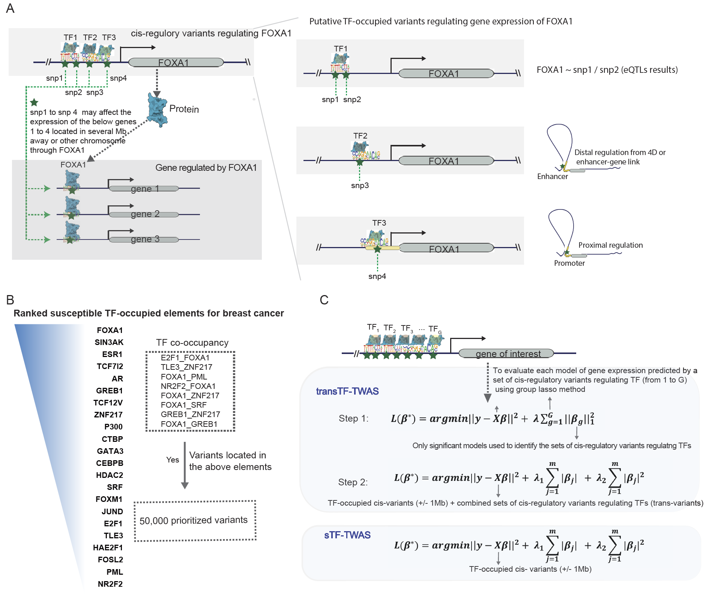

## Users’ Manual of transTF-TWAS
## Overview
Transcriptome-wide association studies (TWAS) have been successful in identifying disease susceptibility genes by integrating gene expression predictions with genome-wide association studies (GWAS) data. However, current TWAS models only consider cis-located variants to predict gene expression. Here, we introduce transTF-TWAS, which includes transcription factor (TF)-linked trans-located variants for model building. Our results demonstrate that transTF-TWAS surpasses other approaches in both enhancing prediction models and identifying disease-associated genes. Using data from the Genotype-Tissue Expression project, we predict alternative splicing and gene expression and applied these models to large GWAS datasets for breast, prostate, and lung cancers. Our analysis revealed total 940 putative cancer susceptibility genes, including 492 that were previously unreported in GWAS loci and 143 in loci unreported by GWAS, at Bonferroni-corrected P < 0.05. Our approach has enabled significant progress in gene discovery and has shed light on several genetically-driven key regulators and their associated regulatory networks underlying disease susceptibility.

## Methods
### 1. Prepare input data: 
**1) Identifying TF-cis-regulatory-variants :**\
To determine a set of the cis-regulatory variants that potentially regulate TF expression (namely TF-cis-regulatory-variants), we first prioritized putative regulatory variants by only including TF-occupied variants that are located in DNase I hypersensitive sites (DHSs) (https://www.meuleman.org/research/dhsindex/), enhancer regions (http://compbio.mit.edu/epimap) and promoter regions (https://fantom.gsc.riken.jp/5/data/). Of them, the significant associations between a TF and its cis-genetic variants were identified at a nominal p-value < 0.05, based on the eQTL analysis in both target tissues and whole blood samples using data from GTEx portal (https://www.gtexportal.org/home/datasets/) and eQTLGen (https://www.eqtlgen.org/cis-eqtls.html). Furthermore, we also analyzed epigenetic data to search regulating evidence by these variants through interactions with proximal promoters or distal enhancer-promoter regions. Specifically, we examined if these variants are located in the promoter region of a TF (TSS +/- 2K) or enhance region with an evidence of the enhancer linking to the TF based on expression-enhancer activity correlation across 833 cell-types from the EpiMap repository (https://personal.broadinstitute.org/cboix/epimap/links/links_corr_only/), as well as chromatin-chromatin interaction data from the 4D genomics (https://4dgenome.research.chop.edu/Tables/4DGenome_HomoSapiens_hg19.txt) and previous literature[1]. Finally, the TF-cis-regulatory-variants were identified based on the significant associations from eQTL results, and the regulatory evidence from the variants linked to the TF.

For each gene, we prepared a csv file that contains all TF-based trans-variants (TFx) for all TF-genes that regulate this target gene with the format as below:

TF,CHR,LOC,GTEX-1117F,GTEX-1122O,GTEX-11EM3,GTEX-11EMC,GTEX-11GSP,GTEX-11I78,GTEX-11P81, … … \
GREB1_1,2,10494090,0,0,0,0,0,0,0,1,0,0,0,0,0,0,0,0,0,0,0,0,0,0,0,0,0,0,0,0,0,0,0,0,0,0,0,0,0,0,0,0,0,0,0,0,0, … … \
GREB1_2,2,10494743,2,1,1,1,1,2,0,2,0,0,2,0,1,1,1,1,1,1,0,1,0,0,1,1,2,0,1,1,1,1,1,2,0,0,0,0,1,1,0,0,1,0,1,1,1, … … \
GREB1_3,2,10494930,2,1,2,2,1,2,1,2,0,2,2,1,1,2,2,1,2,2,1,2,2,2,2,2,2,2,2,2,2,1,2,2,1,1,2,2,1,2,2,2,1,1,2,2,2, … … \
 … … \
FOXA1_1,14,37708623,0,0,0,1,1,1,0,0,0,0,0,0,0,1,0,1,0,0,1,0,0,0,0,0,1,0,0,1,0,0,0,0,0,0,0,0,0,0,0,0,0,0,0,0, … … \
FOXA1_2,14,37709692,0,1,0,1,0,1,0,1,1,2,2,0,2,1,2,1,0,0,2,0,0,0,1,2,2,1,0,2,1,1,0,2,0,1,1,1,0,1,0,1,1,1,0,2, … … \
FOXA1_3,14,37709729,2,1,2,1,1,1,1,1,1,0,1,2,0,0,1,1,2,1,0,2,2,1,1,0,1,1,2,0,1,2,1,0,2,1,1,1,1,1,1,1,0,1,2,2, … … \
 … … 

**2)	Gene expression file:** \
Take the breast cancer as an example. The fully processed, filtered and normalized gene expression matrices in bed format ("Breast_Mammary.v8.normalized_expression.bed") for prostate tissue was downloaded from GTEx portal (https://gtexportal.org/home/datasets). We included 151 samples in our analysis and removed sex chromosomes, by which we generated a new file named "Breast_Mammary.v8.normalized_expression.no_sex.bed". The covariates used in eQTL analysis, including top five genotyping principal components (PCs), were obtained from GTEx_Analysis_v8_eQTL_covariates.tar.gz, which was downloaded from GTEx portal (https://gtexportal.org/home/datasets). Then, we further performed a probabilistic estimation of expression residuals (PEER) analysis to adjust for top five genotyping PCs, age, and other potential confounding factors (PEERs)[2] for downstream prediction model building. There is a description of how to download and use the PEER tool here: https://github.com/PMBio/peer/wiki/Tutorial. The command that we used is shown as below: 

`Rscript ./code/Peer_Script.R`

According to the GTEx protocol, if the number of samples is between 150 and 250, 30 PEER factors should be used. For our study, the number of samples is 151, so we used 30 PEER factors. This command will generate a residual file named “GeneExpression_Breast_AfterRM_Residuals.csv”, and from this residual file, we generated the final gene expression data file named “Breast_Mammary.v8.normalized_expression.no_sex.rm_covariates.bed” as the input for our downstream predictive model. 

**3)	genotype file:**  
The whole genome sequencing file, GTEx_Analysis_2017-06-05_v8_WholeGenomeSeq_866Indiv.vcf, was downloaded from dbGaP (https://www.ncbi.nlm.nih.gov/projects/gap/cgi-bin/study.cgi?study_id=phs000424.v8.p2). The genotype dataset is quality controlled using the tool PLINK [3] (https://zzz.bwh.harvard.edu/plink/ ). Multiple QC steps were applied by excluding variants with missingness rate > 0.1, minor allele frequency > 0.01, high deviations from Hardy-Weinberg equilibrium at p<10-6, and removing samples with missingness rate > 0.1.

Take the breast cancer as an example. We prioritized putative regulatory variants based on their associations with breast cancer risk. For variants that bind to only one TF, we used the single TF beta value, and for other variants that bind to more than one TFs, we considered the largest beta values of the paired TFs. Once we obtained the beta values for all TF-occupied elements, we ranked those variants based on the beta values from largest to smallest, which illustrated with more important to less for breast cancer risk. As illustrated in our previous work [4], we only included top 50K TF-occupied regulatory variants. 

The tissue specific input genotype file ("genotype_file") with the format as below:

 CHR,LOC,GTEX-1117F,GTEX-1122O,GTEX-11EM3,GTEX-11EMC,GTEX-11GSP,GTEX-11I78,GTEX-11P81, … … \
 1,933303,0,0,0,0,0,0,0,0,1,0,0,0,1,0,0,0,0,0,0,0,0,0,0,0,0,0,0,0,0,0,0,0, … … \
 1,933411,1,2,2,2,2,2,2,2,2,2,2,2,1,2,2,2,2,2,2,2,2,2,2,2,2,2,2,2,2,2,2,2,2, … … \
 1,933653,0,0,0,0,0,0,0,0,0,0,0,0,0,0,0,0,0,0,0,0,0,0,0,1,0,0,0,0,0,1,0,0,0, … … \
 … …

The input genotype file for calculating covariance ("covariance_genotype_file") should be non-tissue specific, with the same format as the tissue specific input genotype file.

**3)	SNP annotation file:** \
The input snp annotation file ("snp_annot_file"), contains only the top 50K regulatory variants with the format as below: 

SNP,varID,chr,pos,ref,effect \
rs1578391,chr1_629906_C_T_b38,1,629906,C,T \
rs6594029,chr1_630026_C_T_b38,1,630026,C,T \
rs114983708,chr1_778639_A_G_b38,1,778639,A,G \
rs71507461,chr1_827209_G_C_b38,1,827209,G,C \
rs71507462,chr1_827212_C_G_b38,1,827212,C,G \
… …

**4)	Gene annotation file:** \
The input gene annot file ("gene_annot_file") is downloaded from GENCODE: https://www.gencodegenes.org/human/release_26.html, in the GTF format and build in GRCh38.

**5)	GWAS file:** \
The input GWAS file ("gwas_file") contains "chr" and "position" columns, we just need to make sure that all the SNPs being trained in the Elastic Net model can be found in the GWAS dataset.

### 2. Gene expression prediction model building based on trans-located variants:
We analyzed TF ChIP-seq data generated in target cancer-related cells to characterize their genome-wide binding sites for susceptible TFs using data from the Cistrome database(http://cistrome.org/).  We next characterized each gene potentially regulated by all possible susceptible TFs based on the evidence of their TF-DNA binding sites that are located in its flanking 20bk of TSS (i.e., number of G TFs; Fig. 1C). For each TF, we assessed the performance of a prediction model that utilized its TF-cis-regulatory-variants to predict expression of each target gene using group lasso method. We trained a group lasso to select a group of TF-cis-regulatory-variants from each TF (i.e., 1 to G TF). Only significant models were used to determine those groups of TF-cis-regulatory-variants that may affect the expression of the gene. The final set of TF-cis-regulatory variants was identified for downstream gene expression model building by combining the groups from the significant models. We next built gene expression prediction models for the final sets of TF-cis-regulatory variants and cis TF-occupied variants under our sTF-TWAS framework [4].

We processed one chromosome at a time by executing the below code, take chromsome 1 as an example:\
`Rscript ./code/transTF_TWAS.R  1`

### References: 
1. Rhie, S.K., Perez, A.A., Lay, F.D. et al. A high-resolution 3D epigenomic map reveals insights into the creation of the prostate cancer transcriptome. Nat Commun 10, 4154 (2019).
2. Stegle, O., Parts, L., Piipari, M., Winn, J., and Durbin, R. (2012). Using probabilistic estimation of expression residuals (PEER) to obtain increased power and interpretability of gene expression analyses. Nat Protoc 7, 500-507.
3. Purcell, S., Neale, B., Todd-Brown, K., Thomas, L., Ferreira, M.A., Bender, D., Maller, J., Sklar, P., de Bakker, P.I., Daly, M.J., et al. (2007). PLINK: a tool set for whole-genome association and population-based linkage analyses. Am J Hum Genet 81, 559-575.
4. He, J., Wen, W., Beeghly, A., Chen, Z., Cao, C., Shu, X.O., Zheng, W., Long, Q., and Guo, X. (2022). Integrating transcription factor occupancy with transcriptome-wide association analysis identifies susceptibility genes in human cancers. Nat Commun 13, 7118. 10.1038/s41467-022-34888-0.

### Contacts
  Jingni He: jingni.he1@ucalgary.ca 
  Quan Long: quan.long@ucalgary.ca 
  Xingyi Guo: xingyi.guo@vumc.org 

